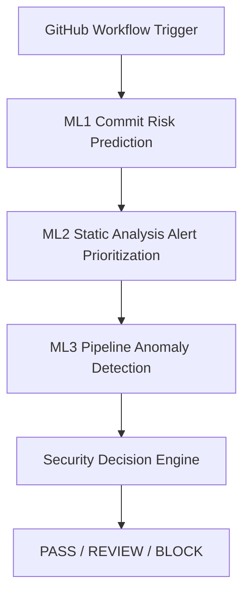

# AI-Driven DevSecOps Framework

This repository contains an MSc dissertation framework implementing an AI-driven DevSecOps pipeline with GitHub Actions for C/C++ security analysis. It combines ML1 Commit Risk Prediction, ML2 Static Analysis Alert Prioritization, ML3 Pipeline Anomaly Detection, and a Security Decision Engine into one integrated workflow. The frozen implementation produces deterministic, explainable CI/CD security decisions from component reports.

## Overview

This framework operationalizes AI-assisted DevSecOps by integrating four runtime components in a single CI/CD workflow:

- ML1 commit risk prediction
- ML2 static-analysis alert prioritization
- ML3 pipeline anomaly detection
- Security Decision Engine

The implementation is frozen and designed around generated reports as the contract between components, allowing deterministic, auditable security decisions during pull request and push workflows.

## Framework Architecture



## Key Features

- Commit-level risk prediction from changed C/C++ functions (ML1).
- Static-analysis alert prioritization for Cppcheck and Clang outputs (ML2).
- Repository-specific behavioural anomaly detection using historical pipeline metrics (ML3).
- Centralized deterministic decision hierarchy that outputs PASS, REVIEW, or BLOCK.
- Composite GitHub Action integration for end-to-end CI/CD execution.
- Explainable report artifacts with counts, reasons, and concise issue summaries.
- Optional persistence of ML3 historical state to the consuming repository.

## Repository Structure

```text
.
|-- action.yml
|-- README.md
|-- doc/
|   |-- ML1/
|   |-- ML2/
|   |-- ML3/
|   `-- decision_engine/
|-- ml/
|   |-- commit_risk/
|   |-- alert_prioritizer/
|   |-- anomaly_detection/
|   `-- decision_engine/
|-- models/
|   |-- commit_risk/
|   `-- alert_prioritizer/
|-- data/
|   |-- raw/
|   |-- processed/
|   |-- intermediate/
|   `-- features/
|-- reports/
|   |-- commit_risk/
|   |-- alert_prioritizer/
|   |-- anomaly_detection/
|   `-- final_decision/
`-- logs/
```

## Framework Workflow

The composite action in [action.yml](action.yml) executes the runtime sequence below.

GitHub Workflow Trigger

↓

ML1

↓

ML2

↓

ML3

↓

Decision Engine

↓

Workflow completion

Execution order implemented in the action:

1. Install SAST tooling and Python dependencies.
2. Run Cppcheck and Clang Static Analyzer scans.
3. Run ML1 commit risk prediction.
4. Run ML2 Cppcheck alert prioritization.
5. Run ML2 Clang alert prioritization.
6. Run ML3 metrics collection, model training/update, and anomaly detection.
7. Optionally persist ML3 state under .devsecops/anomaly_detection.
8. Run Security Decision Engine and emit final decision report.
9. Upload generated artifacts.

## Components

### ML1

ML1 predicts risk levels for changed C/C++ functions and aggregates function-level outputs into commit-level security context. It produces function-level and summary reports consumed by ML3 and the Decision Engine.

Primary runtime outputs:

- reports/commit_risk/commit_risk_report.csv
- reports/commit_risk/commit_risk_summary.csv

### ML2

ML2 prioritizes static-analysis alerts into LOW, MEDIUM, and HIGH categories for two analyzers:

- Cppcheck prioritizer
- Clang prioritizer

Primary runtime outputs:

- reports/alert_prioritizer/cppcheck/prioritised-alerts.csv
- reports/alert_prioritizer/clang/prioritised-alerts.csv

### ML3

ML3 performs repository-specific CI/CD anomaly detection from aggregated historical metrics rather than fixed thresholds. It supports cold-start behavior, model retraining from history, and append-once state persistence.

Primary runtime outputs:

- reports/anomaly_detection/current_pipeline_metrics.csv
- reports/anomaly_detection/anomaly_report.csv
- reports/anomaly_detection/anomaly_model_comparison.csv
- reports/anomaly_detection/synthetic_evaluation.csv
- reports/anomaly_detection/synthetic_evaluation_summary.json

Runtime state and model artifacts:

- .devsecops/anomaly_detection/pipeline_metrics.csv
- .devsecops/anomaly_detection/models/anomaly_model.pkl
- .devsecops/anomaly_detection/models/anomaly_scaler.pkl
- .devsecops/anomaly_detection/models/anomaly_model_metadata.json

### Security Decision Engine

The Decision Engine consolidates ML1, ML2, and ML3 report outputs into one final decision row and governs workflow gate behavior. Its hierarchy is deterministic and ordered.

Primary runtime output:

- reports/final_decision/security_decision.csv

## Installation

### Prerequisites

- GitHub Actions runner environment with Python 3.
- C/C++ static analysis tooling available to install through apt:
	- cppcheck
	- clang
	- clang-tools
- Python packages:
	- pandas
	- scikit-learn
	- joblib
	- numpy

Note: the composite action installs required SAST tools and core Python packages during workflow execution.

### Repository checkout

Add checkout with full history for robust diff-based ML1 analysis:

```yaml
- uses: actions/checkout@v4
	with:
		fetch-depth: 0
```

## Usage

Use the composite action in a repository workflow.

```yaml
name: AI DevSecOps Security Scan

on:
	pull_request:
	push:

jobs:
	security-scan:
		runs-on: ubuntu-latest
		steps:
			- uses: actions/checkout@v4
				with:
					fetch-depth: 0

			- name: Run AI-Driven DevSecOps Framework
				uses: MishelRossmaree/ai-driven-devsecops-framework@main
				with:
					scan-path: "."
					ml1-high-threshold: "70"
					ml1-medium-threshold: "40"
					ml1-review-confidence-threshold: "0.2"
					ml3-min-rows: "30"
					ml3-persist-state: "false"
```

Important action inputs from [action.yml](action.yml):

- scan-path: path to scan in the target repository.
- ml1-high-threshold: ML1 HIGH risk threshold.
- ml1-medium-threshold: ML1 MEDIUM risk threshold.
- ml1-review-confidence-threshold: ML1 low-confidence review threshold.
- ml3-min-rows: minimum valid historical rows required for ML3 training.
- ml3-persist-state: whether ML3 state is committed and pushed back (subject to action condition guards).

## Generated Reports

### ML1

- reports/commit_risk/commit_risk_report.csv
- reports/commit_risk/commit_risk_summary.csv

### ML2

Cppcheck scan and prioritization:

- reports/cppcheck-report.xml
- reports/alert_prioritizer/cppcheck/prioritised-alerts.csv

Clang scan and prioritization:

- reports/clang-output.txt
- reports/clang-report/ (scan artifacts)
- reports/alert_prioritizer/clang/prioritised-alerts.csv

### ML3

- reports/anomaly_detection/current_pipeline_metrics.csv
- reports/anomaly_detection/anomaly_report.csv
- reports/anomaly_detection/anomaly_model_comparison.csv
- reports/anomaly_detection/synthetic_evaluation.csv
- reports/anomaly_detection/synthetic_evaluation_summary.json

### Decision Engine

- reports/final_decision/security_decision.csv

## Decision Outcomes

- PASS: no higher-priority ML1/ML2 signals and no escalatory ML3 condition.
- REVIEW: manual review required, including ML1 REVIEW_REQUIRED, ML3 anomaly/failure, malformed-schema ML3 unavailability, or medium severity signals.
- BLOCK: at least one ML1 HIGH or ML2 HIGH finding; action exits non-zero.

## Documentation

- ML1 Overview: [doc/ML1/ML1-OVERVIEW.md](doc/ML1/ML1-OVERVIEW.md)
- ML1 Guide: [doc/ML1/ML1-guide.md](doc/ML1/ML1-guide.md)
- ML2 Overview (Cppcheck): [doc/ML2/ML2-CPPHECK-OVERVIEW.md](doc/ML2/ML2-CPPHECK-OVERVIEW.md)
- ML2 Guide (Cppcheck): [doc/ML2/ML2-CPPHECK-GUIDE.md](doc/ML2/ML2-CPPHECK-GUIDE.md)
- ML2 Overview (Clang): [doc/ML2/ML2-CLANG-OVERVIEW.md](doc/ML2/ML2-CLANG-OVERVIEW.md)
- ML2 Guide (Clang): [doc/ML2/ML2-CLANG-GUIDE.md](doc/ML2/ML2-CLANG-GUIDE.md)
- ML3 Overview: [doc/ML3/ML3-OVERVIEW.md](doc/ML3/ML3-OVERVIEW.md)
- ML3 Guide: [doc/ML3/ML3-GUIDE.md](doc/ML3/ML3-GUIDE.md)
- Decision Engine Overview: [doc/decision_engine/DECISION_ENGINE-OVERVIEW.md](doc/decision_engine/DECISION_ENGINE-OVERVIEW.md)
- Decision Engine Guide: [doc/decision_engine/DECISION_ENGINE-GUIDE.md](doc/decision_engine/DECISION_ENGINE-GUIDE.md)

## Limitations

Only implementation-real limitations are listed.

- Current runtime scope is C/C++ static analysis pipelines.
- ML2 prioritizers depend on expected scanner output formats.
- ML3 training requires sufficient valid historical rows; cold start can produce NOT_AVAILABLE.
- Decision Engine escalates ML3 NOT_AVAILABLE only for malformed/schema-indicating reason patterns.
- Decision Engine enforces hard gate failure only for BLOCK; REVIEW remains exit code 0.
- Reports are the integration contract; malformed non-empty schemas may cause component-level runtime failures.

## Future Enhancements

The following are prospective improvements and are not part of the frozen implementation.

- Extend scanner and prioritizer support to additional static-analysis tools.
- Add stricter schema contracts and preflight validation across all report interfaces.
- Introduce optional policy modes where REVIEW can fail the workflow.
- Expand anomaly feature space with additional pipeline telemetry while preserving reproducibility.
- Add packaged release/version tags and formal benchmark suites for cross-repository evaluation.

## License

License information to be added.