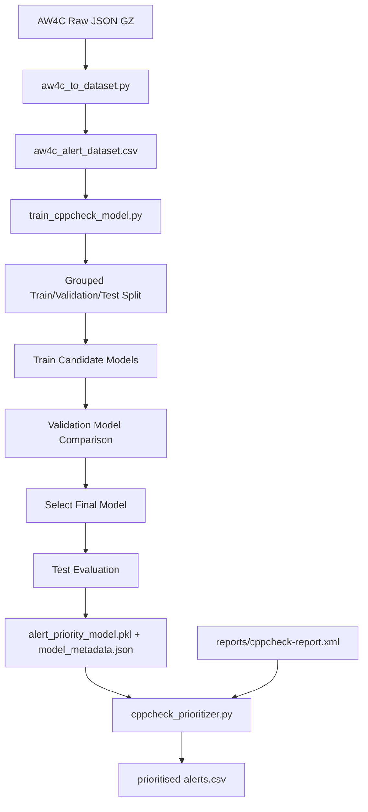
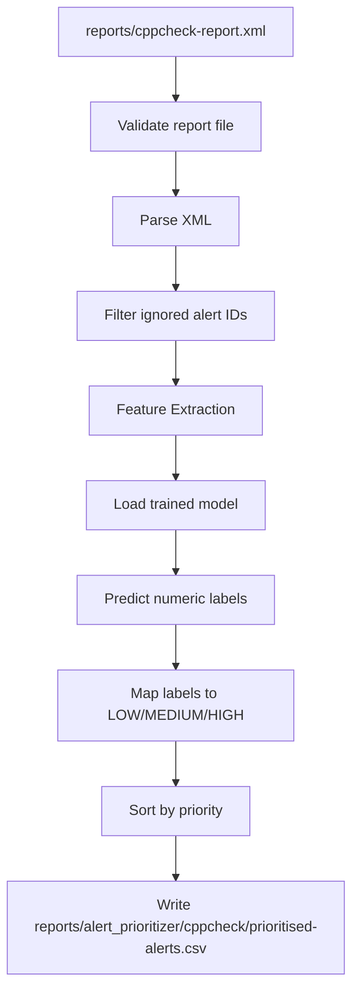

# ML2 Cppcheck Guide

This guide explains what ML2 Cppcheck does, how it is trained, how runtime prioritisation works, and how to validate it end-to-end based on the current committed implementation.

## What ML2 Cppcheck Does

ML2 Cppcheck prioritises static-analysis alerts into operational priority levels (`LOW`, `MEDIUM`, `HIGH`) so security triage can focus first on the most consequential findings.

Within the AI-Driven DevSecOps Framework:

- ML1 scores commit-level code risk (`commit_risk_report.csv`).
- ML2 scores SAST alert priority (`prioritised-alerts.csv` for Cppcheck and Clang).
- ML3 models pipeline anomalies from historical run metrics.
- The Security Decision Engine combines ML1, ML2, and ML3 outputs to produce `BLOCK`, `REVIEW`, or `PASS`.

For Cppcheck specifically, ML2 consumes `reports/cppcheck-report.xml` and emits `reports/alert_prioritizer/cppcheck/prioritised-alerts.csv`.

Final deployed model:

- The final deployed ML2 Cppcheck model is `RandomForest`.
- It is selected using the validation-based strategy defined in the training pipeline.
- The deployed model artifact is `models/alert_prioritizer/cppcheck/alert_priority_model.pkl`.

Final evaluation-split improvement:

- Training uses grouped train/validation/test splitting by source file.
- The same source file cannot appear across splits.
- Duplicate overlap across splits is explicitly checked and prevented.
- This improves evaluation quality by reducing information leakage between training and evaluation data.

## Complete Architecture

## Dataset Generation

Script:

- `ml/alert_prioritizer/cppcheck/aw4c_to_dataset.py`

Inputs:

- `data/raw/alert_prioritizer/cppcheck/compressed_ActionableWarning.json.gz`
- `data/raw/alert_prioritizer/cppcheck/compressed_NonActionableWarning.json.gz`

Processing steps:

1. Load actionable and non-actionable AW4C warning records.
2. Normalize fields into a single tabular schema.
3. Generate priority labels from current rules:
- If `is_actionable == 0` -> `LOW`
- If `is_actionable == 1` and severity in `error|critical` -> `HIGH`
- Else `MEDIUM`
4. Map priorities to numeric labels:
- `LOW=0`, `MEDIUM=1`, `HIGH=2`
5. Build derived features used by training and runtime.
6. Remove exact duplicates using these identity fields:
- `tool`, `file`, `line`, `alert_id`, `cwe`, `severity`, `message`, `is_actionable`, `priority`, `label`
7. Print row count before and after deduplication.

Output:

- `data/processed/alert_prioritizer/cppcheck/aw4c_alert_dataset.csv`

Current committed metadata reports:

- rows before dedup: `76273`
- rows after dedup: `69450`
- duplicate rows removed: `6823`
- class distribution:
  - label `0` (LOW): `38028` (`54.7559%`)
  - label `1` (MEDIUM): `28370` (`40.8495%`)
  - label `2` (HIGH): `3052` (`4.3945%`)

## Feature Engineering

ML2 Cppcheck uses the following feature set:

Numeric/binary engineered features:

- `severity_score`: ordinal severity mapping (`critical=4`, `error=3`, `warning/performance/portability=2`, `style/information=1`, else `0`)
- `has_cwe`: indicator that CWE is present and non-empty
- `is_null_pointer`: message contains null-pointer terms
- `is_buffer_issue`: message contains buffer/overflow terms
- `is_memory_issue`: message contains memory/leak/free/dereference terms
- `is_obsolete_function`: message contains unsafe C API terms (`gets`, `strcpy`, `strcat`, `sprintf`)
- `is_cppcheck`: tool indicator (`1` for Cppcheck)

Categorical/text features:

- `alert_id`: Cppcheck warning identifier
- `severity`: Cppcheck severity label
- `cwe`: CWE value as string
- `message`: warning text

Preprocessing in training pipeline:

- Numeric features -> `StandardScaler`
- Categorical features -> `OneHotEncoder(handle_unknown="ignore")`
- Message text -> `TfidfVectorizer(max_features=3000, ngram_range=(1,2))`

Why these features were selected in the current implementation:

- They encode intrinsic alert semantics (type, severity, CWE, text cues).
- They preserve compatibility between offline training and runtime prediction.
- They are lightweight and deterministic for CI/CD execution.

## Training Pipeline

Script:

- `ml/alert_prioritizer/cppcheck/train_cppcheck_model.py`

Pipeline stages:

1. Load processed Cppcheck dataset.
2. Apply exact deduplication (same identity fields as dataset script).
3. Confirm required columns exist.
4. Confirm all required classes (`0,1,2`) exist.
5. Build grouped data split by source `file`.

Split strategy:

- Deterministic seed: `42`
- Test size: `0.2`
- Validation size: `0.2`
- Grouping: by source file path (`GroupShuffleSplit`)
- Search trials: `120` (chooses split with closest class distribution to full dataset)

Integrity checks:

- No source-file overlap across train/validation/test.
- No exact duplicate identity rows across splits.
- Required classes present in each split.

Current committed split summary (from metadata):

- Train: `41221` rows, `8267` file groups
- Validation: `13356` rows, `2756` file groups
- Test: `14873` rows, `2756` file groups
- Overlap checks: all `0`

## Candidate Models

The training script evaluates exactly four candidate models:

- Logistic Regression
- SVM (`LinearSVC`)
- Random Forest
- ANN (`MLPClassifier`)

Why these models are evaluated in the current pipeline:

- They provide a balanced comparison across linear, margin-based, tree-based, and neural classifiers.
- They are mature, reproducible, and practical for structured + text hybrid features in CI contexts.

## Model Selection Strategy

Selection is performed on the validation split only.

Implemented strategy:

1. Primary metric: `Macro_F1`
2. Secondary metric: `HIGH_Recall`
3. Tie-breakers: `Weighted_F1`, then `Accuracy`

Why this is appropriate for security prioritisation:

- Macro F1 gives equal weight to all priority classes and avoids majority-class dominance.
- HIGH-class recall prioritises recovery of severe security alerts.
- Weighted F1 and accuracy remain informative tie-breakers without dominating selection.

## Final Selected Model

Current committed metadata identifies:

- Selected model: `RandomForest`
- Saved model: `models/alert_prioritizer/cppcheck/alert_priority_model.pkl`
- Metadata: `models/alert_prioritizer/cppcheck/model_metadata.json`

Evaluation artifacts:

- Validation comparison: `reports/alert_prioritizer/cppcheck/validation_model_comparison.csv`
- Final untouched test evaluation: `reports/alert_prioritizer/cppcheck/test_evaluation.csv`

Both evaluation CSVs include:

- aggregate metrics (`Accuracy`, `Weighted_F1`, `Macro_F1`, `HIGH_Recall`)
- per-class precision, recall, F1, support
- confusion matrix (serialized)

## Reproducibility

The final ML2 Cppcheck implementation preserves the key artifacts needed for reproducibility:

- trained model: `models/alert_prioritizer/cppcheck/alert_priority_model.pkl`
- model metadata: `models/alert_prioritizer/cppcheck/model_metadata.json`
- validation evaluation: `reports/alert_prioritizer/cppcheck/validation_model_comparison.csv`
- final test evaluation: `reports/alert_prioritizer/cppcheck/test_evaluation.csv`

Together, these artifacts capture model identity, split configuration, selection logic, and measured performance for repeatable verification.

## Runtime Pipeline

Script:

- `ml/alert_prioritizer/cppcheck/cppcheck_prioritizer.py`

Runtime flow:

Ignored Cppcheck IDs at runtime:

- `checkersReport`
- `missingIncludeSystem`
- `missingInclude`

Prediction mapping:

- `0 -> LOW`
- `1 -> MEDIUM`
- `2 -> HIGH`

## Runtime Validation

The prioritizer performs explicit validation in current code:

Report validation:

- report exists
- report is non-empty
- XML parses successfully

Model validation:

- model file exists
- model file can be loaded (`joblib.load`)

Feature validation:

- required feature columns exist before prediction

Prediction validation:

- model prediction exceptions are caught and treated as failure

## Runtime Outcome Semantics

### COMPLETED WITH ALERTS

Conditions:

- XML report exists, non-empty, valid
- parsed report contains non-ignored alerts
- model loads
- prediction succeeds
- `prioritised-alerts.csv` written with prioritized rows

### COMPLETED WITH ZERO ALERTS

Conditions:

- XML report exists, non-empty, valid
- parsed report contains zero non-ignored alerts
- model has already loaded successfully
- empty `prioritised-alerts.csv` (headers only) is written

### FAILED

Failure conditions implemented:

- `reports/cppcheck-report.xml` missing
- `reports/cppcheck-report.xml` empty
- malformed XML
- model file missing
- model load failure
- required prediction feature columns missing
- prediction call failure

Failure handling:

- clear `FAILED: ...` message to stderr
- process exits non-zero (`SystemExit(1)`)

## Output Files

Model artifacts:

- `models/alert_prioritizer/cppcheck/alert_priority_model.pkl`
  - serialized trained pipeline (preprocessor + classifier)
- `models/alert_prioritizer/cppcheck/model_metadata.json`
  - dataset counts and class distribution
  - deduplication identity fields
  - grouped split strategy and seed
  - split overlap checks
  - selected model and parameters
  - artifact paths

Evaluation artifacts:

- `reports/alert_prioritizer/cppcheck/validation_model_comparison.csv`
  - per-candidate validation metrics and per-class metrics
- `reports/alert_prioritizer/cppcheck/test_evaluation.csv`
  - selected model test metrics and per-class metrics

Runtime artifact:

- `reports/alert_prioritizer/cppcheck/prioritised-alerts.csv`
  - columns: `priority, tool, file, line, alert_id, cwe, severity, message`
  - sorted by priority (`HIGH` first)

## Runtime Verification

The following runtime checks were executed against the current implementation.

| Scenario | Expected Behaviour | Observed Behaviour | Status |
|---|---|---|---|
| Valid XML with alerts | Success, prioritized rows written | Exit `0`; `COMPLETED WITH ALERTS`; prioritized CSV written with alert row | PASS |
| Valid XML with zero alerts | Success, empty CSV with headers | Exit `0`; `COMPLETED WITH ZERO ALERTS`; header-only CSV written | PASS |
| Missing XML | Fail with clear error and non-zero exit | Exit `1`; stderr `FAILED: Cppcheck report missing...` | PASS |
| Malformed XML | Fail with clear error and non-zero exit | Exit `1`; stderr `FAILED: Cppcheck report XML is malformed...` | PASS |
| Missing model | Fail with clear error and non-zero exit | Exit `1`; stderr `FAILED: Model file not found...` | PASS |
| Missing model with zero alerts | Still fail (model validated every run) | Exit `1`; stderr `FAILED: Model file not found...` | PASS |

Why these tests improve robustness:

- They verify strict separation between valid no-alert outcomes and actual runtime failures.
- They ensure model/report prerequisites are enforced before downstream decision logic consumes outputs.
- They prevent silent false-success states in CI/CD security gating.

## Limitations

Current implementation limitations:

- Label generation is rule-derived from AW4C actionable/severity fields, not manually adjudicated triage outcomes.
- Runtime output includes priority labels but no explicit prediction confidence field.
- XML parser uses expected Cppcheck error/location structure; unusual schema variants may fail.
- Domain shift risk remains between AW4C-derived training data and real project warning distributions.

## Future Improvements

Realistic next steps aligned with the existing architecture:

- Persist training/evaluation run identifiers (dataset hash, training timestamp, git SHA) in metadata for stronger traceability.
- Add an optional runtime confidence field where supported by model type, while preserving current priority schema for compatibility.
- Extend robustness tests to include corrupted model binaries and atypical Cppcheck XML variants as regression checks.
- Support prioritisation of additional static analysis tools beyond Cppcheck.
